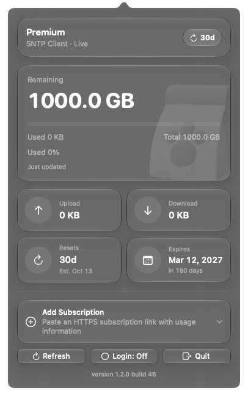

> **build 49**：Stash、Clash、Surge、Hiddify、Loon、sing-box のインポートリンク解析を追加。[対応範囲と制限](docs/client-compatibility.md)。自動検出の追加ではありません。通信量の表示はプロバイダーのデータに依存します。

<p align="center">
  
</p>

<h1 align="center">ByteKibble</h1>
<p align="center"><a href="https://mustundead.com">MU Labs</a> が制作</p>
<p align="center">サブスクリプションの残り通信量を、ひと目で。</p>
<p align="center"><a href="README.md">简体中文</a> · <a href="README.zh-Hant.md">繁體中文</a> · <a href="README.en.md">English</a> · <a href="README.ko.md">한국어</a> · 日本語</p>

ByteKibble は、**残り通信量、使用量、契約の有効期限、リセットの予定**を確認できる macOS メニューバーアプリです。対応する Clash 系クライアントと SNTP の契約を自動検出し、Quantumult／Quantumult X、Surge で使う HTTPS サブスクリプション URL の手動追加と、Shadowsocks SIP008 の通信量フィールドに対応します。取得できる情報は提供元のデータによって異なります。詳しい条件は以下の対応範囲をご覧ください。

> **1.2.0（49）プレリリース**：アプリのソース、初回起動時のウェルカム画面、Apple silicon（arm64）用パッケージを提供します。Developer ID で署名済みですが、**Apple の公証は受けていません**。[ダウンロードと更新内容](https://github.com/mustundead/ByteKibble/releases/tag/v1.2.0-build49)。`preview/` 内の画像は過去のバージョンです。

**アプリ内更新（build 47 以降）：** 下部のバージョン番号から更新の確認や自動確認の無効化ができます。インストールには確認が必要です。build 46 以前は一度手動で更新してください。更新確認は GitHub に接続しますが、サブスクリプション URL や通信量は送信しません。プレビュー版は専用の更新フィードを使用します。



ネイティブメニューの実行画面 · 残り通信量 100%（サンプルデータ、実際の契約ではありません）

## できること

- **メニューバーに残量を表示**：数値は残り通信量、円グラフは残りの割合を示します。クライアントのリセット情報がある場合はカウントダウンも表示します。
- **詳細をひとつのパネルに**：プラン名、残量／使用量／合計、アップロード・ダウンロード量、推定リセット日、有効期限、取得元と更新時刻を確認できます。
- **複数の契約を切り替え**：読み取り可能なクライアント設定から検出するほか、HTTPS のサブスクリプション URL を手動で追加できます。
- **必要なときに警告**：残量が 20% 未満ならオレンジ、10% 未満なら赤。残量不足や使い切った状態は文字でも示します。
- **macOS になじむ操作**：SwiftUI、ライト／ダーク表示、等幅数字、「視差効果を減らす」設定への対応、オン／オフがわかるログイン時起動の表示。
- **5 言語に対応**：簡体字中国語、繁体字中国語、英語、韓国語、日本語。

ByteKibble は**プロキシクライアント、VPN、速度測定ツール、アプリ別の通信量計ではありません**。Clash／Mihomo の代わりに通信をルーティングしたり、提供元の利用可能量を変更したりすることはありません。

## 色と進捗の見方

| 残量の割合 | 表示色 | 意味 |
| --- | --- | --- |
| 20% 以上 | 外観に応じた黒／白 | 通常 |
| 10% 以上、20% 未満 | オレンジ | 残量不足 |
| 10% 未満 | 赤 | 残量がごくわずか、または使い切った状態 |

メニューバーの円グラフは**残りの割合**、詳細カードの横棒は「使用済み」の数値と同じ**使用済みの割合**を表します。警告色は通信量の残量に対するもので、プランの等級、接続状態、自動起動の設定を示すものではありません。リセット日が近いこと自体はエラーではありません。

## データの取得元

**現在の対応範囲（build 49）：** 自動検出と手動インポートは別の機能です。Stash、Clash、Surge、Hiddify、Loon、sing-box の対応するインポートリンクを貼り付けると、Mac 上で HTTPS サブスクリプション URL のみを抽出します。Quantumult／Quantumult X は元の HTTPS URL を手動で追加できます。提供元が `Subscription-Userinfo` または対応する Shadowsocks SIP008 の通信量フィールドを返す必要があります。これらのクライアントの自動検出を追加したものではなく、すべてのクライアント・提供元での実機検証は完了していません。[対応形式と公式資料](docs/client-compatibility.md)。

| 取得元／クライアント | 読み取り・インポート方法 | 補足 |
| --- | --- | --- |
| Clash Verge／Clash Verge Rev | ローカルの `profiles.yaml` 内のサブスクリプション URL | 使用量は提供元へ問い合わせます |
| ClashX／ClashX Meta／ClashX Pro | クライアント設定内のサブスクリプション URL | 読み取り可能な形式で保存されている必要があります |
| SNTP | URL、プランと通信量のキャッシュ、クライアントが報告するリセットまでの日数 | キャッシュの元の更新時刻が不明な場合があります |
| 手動追加 | 貼り付けた HTTPS のサブスクリプション URL | 提供元が解析可能な使用量情報を返す必要があります |
| Stash／Clash | HTTPS URL または対応する `install-config` リンクを手動追加 | Stash は指定形式の `link.stash.ws` 設定リンクにも対応 |
| Surge | HTTPS URL、`#!MANAGED-CONFIG` の先頭行、設定インポートリンク | モジュールや設定内容は実行しません |
| Hiddify | HTTPS URL または対応するサブスクリプションインポートリンク | URL とトークンを保持し、単体ノードは取り込みません |
| Loon／sing-box | HTTPS URL または対応するサブスクリプション・リモート設定リンク | プラグイン、ルール、スクリプト、操作コマンドは実行しません |
| Quantumult／Quantumult X | 元の HTTPS サブスクリプション URL を手動追加 | 提供元の通信量情報が必要です |
| Shadowsocks SIP008 | HTTPS レスポンス内の `bytes_used` と `bytes_remaining` | 送受信の内訳がなければ未提供と表示 |

単体の `ss://`、`vmess://`、`vless://`、`trojan://` ノードは残量照会の対象ではありません。未確認の Shadowrocket 専用リンクや一般的な VPN アカウントの残高は対応範囲に含みません。

最新の使用量は `subscription-userinfo` レスポンスヘッダーから取得し、ヘッダーがない場合は SIP008 JSON の通信量フィールドを読み取ります。**Mihomo コアを使っているだけでは自動検出の対象になりません**。対応する保存形式は上表のとおりです。それ以外は URL の手動追加をお試しください。

アプリ自体がすべての通信を測定するわけではなく、数値は提供元やクライアントの報告に基づきます。ヘッダーの欠落、必須項目の不足、合計がゼロ、取得失敗といった状態を「実測の残量ゼロ」と解釈しないでください。古い数値は取得元と更新時刻を確認してお使いください。

### リセット日と更新

- リセットのカードを押して次回の日付を設定できます。この Mac のみに保存され、手動と `*` で区別します。解除するとサブスクリプション情報に戻ります。過ぎた日付はその旨を表示し、自動で繰り返したり提供元の通信量をリセットしたりしません。

- リセットまでの日数はクライアントからの情報であり、一般的なサブスクリプションヘッダーの標準項目ではありません。カウントダウンと**推定日**はその日数から算出し、提供元が確定したリセット時刻ではありません。古いキャッシュは精度に影響します。
- 情報がない場合に日付を推測することはありません。契約の有効期限と通信量のリセットは別のものです。
- 起動中は定期的に更新し、手動更新もできます。スリープ、通信環境、提供元の応答によって遅れる場合があります。
- 直接接続と一般的なローカルプロキシポート（`7899`、`7890`、`7897`、`6152`）を試します。プロキシクライアントを起動したり、システムのプロキシ設定を変更したりはしません。

## 動作環境とインストール

**macOS 13 以降**が必要です。ネイティブの Liquid Glass 表示は macOS 26 以降で利用し、古い OS では互換スタイルを使用します。対応するプロセッサ、署名、公証の状態は各パッケージのリリースノートをご確認ください。

 [1.2.0（49）の公開ページ](https://github.com/mustundead/ByteKibble/releases/tag/v1.2.0-build49)から DMG または ZIP を入手してください。旧版を終了し、DMG 内の ByteKibble を Applications へドラッグするか、ZIP を展開してアプリを「アプリケーション」へ移動します。ディスク内のコピーではなく「アプリケーション」から起動してください。初回使用時にウェルカム画面を表示します。

配布バイナリは **Apple silicon（arm64）専用**で、Intel 版は含まれません。ローカルビルド、テスト、画面確認は macOS 27 で実施しました。最小デプロイ対象は macOS 13 ですが、すべての旧 OS での実機確認を意味しません。

App アイコンと右下の開いた箱のバッジを保持するには、`-installer.zip` を展開して DMG を取り出してください。DMG を HTTP で直接ダウンロードするとカスタムアイコンのメタデータは保持されませんが、インストール内容は同じです。別の `-arm64.zip` にはアプリ本体が入っています。


macOS が起動をブロックした場合は、入手元、署名、リリースノートを先に確認してください。ファイルを信頼できる場合に限り、[Apple の案内](https://support.apple.com/guide/mac-help/mh40616/mac)に沿って「システム設定 → プライバシーとセキュリティ」で操作してください。**署名と公証は別です**。インストールのためにシステムの安全機能を無効にしないでください。

対応クライアントに契約を読み込むか、ByteKibble へ HTTPS の URL を追加すると利用できます。アプリはメニューバーに常駐します。ログイン時の自動起動は任意で、残量の確認に必須ではありません。

## プライバシー

**解析は Mac 上で行い、サブスクリプション URL を MU Labs や分析プラットフォームにアップロードしません。** クライアント設定の検出、URL の抽出、通信量フィールドの解析にクラウド分析や第三者の変換サービスは使用しません。サブスクリプション内のスクリプト、ルール、ノード設定も実行しません。

**ローカル解析は完全なオフライン動作を意味しません。** 通信量の更新時には提供元の URL に接続し、HTTPS リダイレクトに従う場合があります。提供元には要求に必要な URL／トークンが送られます。ローカルプロキシを使う場合はその設定経路を通ります。アプリの更新確認・ダウンロードは GitHub とその配信サービスに接続しますが、更新機能にサブスクリプション URL、トークン、通信量は渡しません。自動更新確認を無効にしても通信量の更新は停止しません。

現在のソース（インストーラとして未公開）は手動追加した URL をローカルのキーチェーンに保存します。設定には名前とハッシュ識別子のみを保存し、選択状態や手動リセット日付のキーにも元の URL を残しません。旧記録はキーチェーンへの書き込みと読み戻しの確認後に移行します。失敗時は旧記録を保持して通知し、暗号化済みとは表示しません。過去のバックアップや他のクライアント設定は変更しません。侵害された Mac での安全性は保証できません。公開済み build 49 は引き続き URL をローカル設定に保存します。

現在のソースはシステム TLS 検証を維持し、同じ HTTPS ホスト・ポートへのリダイレクトのみ許可します。別ホストの場合は最終 URL を手動追加してください。通信量ヘッダーを取得すると本文のダウンロードを停止し、ヘッダーがない SIP008 本文は 2 MiB に制限します。一時的な接続エラーのみ別のローカルプロキシ経路を試し、HTTP・証明書・解析エラーでは繰り返しません。自動再試行の間隔を延ばしますが、手動更新はすぐに行えます。トークンを含む可能性のある生のネットワークエラーは表示しません。

自動検出はローカルのクライアント設定を読み取ります。追加・削除・取り消しが変更するのはアプリ自身の一覧と手動 URL の保存領域だけで、**提供元の契約を変更・解約しません**。

サブスクリプション URL にはアクセストークンが含まれる場合があります。パスワードと同様に扱ってください。問い合わせ先は対応する提供元です。ローカルプロキシを使う場合は、その設定に従う経路で通信します。ByteKibble 独自の通信中継サーバーはなく、URL を分析プラットフォームへ送信しません。

公開 Issue やスクリーンショットには、URL、トークン、アカウント情報を含めないでください。

## ソースからビルド

Swift ツールチェーンを含む Xcode をインストールした後に実行します。

```bash
git clone https://github.com/mustundead/ByteKibble.git
cd ByteKibble
swift build -c release
```

サードパーティーの実行時依存関係はありません。`swift test -j 2` でテストを実行できます。`bash scripts/package-local.sh release` はホストのアーキテクチャ向けに ad-hoc 署名したアプリを `output/acceptance/` に生成します。パッケージ化には `actool` を含む Xcode が必要です。配布者の Developer ID 署名や公証は自動では行いません。DMG の作成手順は [CHANGELOG](CHANGELOG.md) を参照してください。

## フィードバックとライセンス

[Issues](https://github.com/mustundead/ByteKibble/issues) に macOS とアプリのバージョン、クライアント名、機密情報を除いた再現手順をお知らせください。今後、新しい条件で初めて配布する独自の成果物には[ソース公開・非商用ライセンス](LICENSE)を適用します。非商用利用は無料、商用利用には 権利者の事前の書面による許可が必要です。商用制限があるため、標準的なオープンソースライセンスとは呼びません。

### MU Labs

[MU Labs](https://mustundead.com) が制作。コードの再利用、クレジット、商用許可の要件は [LICENSE](LICENSE) を参照してください。

**過去の許諾は変更しません。** 以前 MIT で提供したコードとバージョン（1.2.0（41）の確認用パッケージを含む）には、商用利用の権利を含めて[従来の MIT 条件](LICENSES/MIT-legacy.txt)が引き続き適用されます。新たに配布する内容の適用範囲は [LICENSE](LICENSE) を参照してください。
> **現在のソース / ローカル build 50（未公開）**：キーチェーン移行、本文の 2 MiB 制限、再試行・キャンセルの改善、同一オリジンの HTTPS リダイレクト検証を実装しました。55 件の自動テストと署名済み候補アプリ内の実キーチェーン検証 11 件が、独立したダミー契約で成功しました。**ダウンロード版は引き続き build 49 で、Apple 未公証です。** [検証範囲と残る制限](docs/security-hardening.md)。
