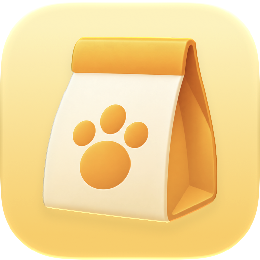
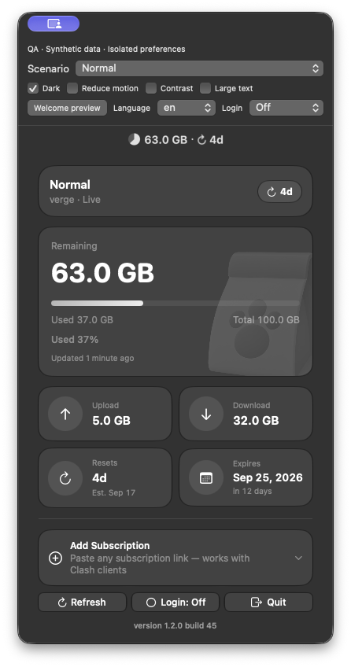
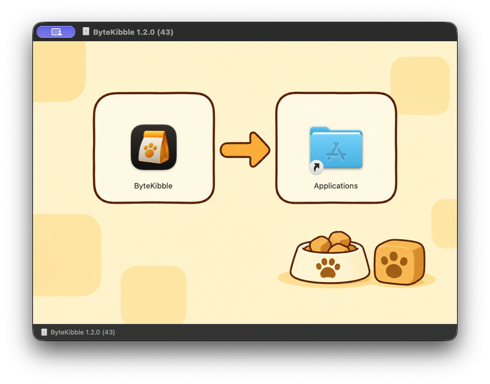

<p align="center">
  
</p>

<h1 align="center">ByteKibble</h1>
<p align="center"><a href="https://mustundead.com">MU Labs</a> が制作</p>
<p align="center">サブスクリプションの残り通信量を、ひと目で。</p>
<p align="center"><a href="README.md">简体中文</a> · <a href="README.zh-Hant.md">繁體中文</a> · <a href="README.en.md">English</a> · <a href="README.ko.md">한국어</a> · 日本語</p>

ByteKibble は、macOS のメニューバーでサブスクリプションの通信量を確認できるネイティブアプリです。Clash 系クライアントや SNTP の利用者が知りたい、**「この契約であとどれだけ使える？」** に答えます。クライアントや提供元のサイトを何度も開かずに、使用量、有効期限、データの取得元を確認できます。

> **1.2.0（45）プレリリース**：アプリのソース、初回起動時のウェルカム画面、Apple silicon（arm64）用パッケージを提供します。Developer ID で署名済みですが、**Apple の公証は受けていません**。[ダウンロードと更新内容](https://github.com/mustundead/ByteKibble/releases/tag/v1.2.0-build45)。`preview/` 内の画像は過去のバージョンです。



1.2.0（45）ネイティブ QA ダーク表示（テストデータ、実際の契約ではありません）

## できること

- **メニューバーに残量を表示**：数値は残り通信量、円グラフは残りの割合を示します。クライアントのリセット情報がある場合はカウントダウンも表示します。
- **詳細をひとつのパネルに**：プラン名、残量／使用量／合計、アップロード・ダウンロード量、推定リセット日、有効期限、取得元と更新時刻を確認できます。
- **複数の契約を切り替え**：読み取り可能なクライアント設定から検出するほか、HTTPS のサブスクリプション URL を手動で追加できます。
- **必要なときに警告**：残量が 20% 未満ならオレンジ、10% 未満なら赤。残量不足や使い切った状態は文字でも示します。
- **macOS になじむ操作**：SwiftUI、ライト／ダーク表示、等幅数字、「視差効果を減らす」設定への対応、オン／オフがわかるログイン時起動の表示。
- **5 言語に対応**：簡体字中国語、繁体字中国語、英語、韓国語、日本語。

ByteKibble は**プロキシクライアント、VPN、速度測定ツール、アプリ別の通信量計ではありません**。Clash／Mihomo の代わりに通信をルーティングしたり、提供元の利用可能量を変更したりすることはありません。

## 色と進捗の見方

| 残量の割合 | 表示色 | 意味 |
| --- | --- | --- |
| 20% 以上 | 外観に応じた黒／白 | 通常 |
| 10% 以上、20% 未満 | オレンジ | 残量不足 |
| 10% 未満 | 赤 | 残量がごくわずか、または使い切った状態 |

メニューバーの円グラフは**残りの割合**、詳細カードの横棒は「使用済み」の数値と同じ**使用済みの割合**を表します。警告色は通信量の残量に対するもので、プランの等級、接続状態、自動起動の設定を示すものではありません。リセット日が近いこと自体はエラーではありません。

## データの取得元

| 取得元 | 自動で読み取る情報 | 補足 |
| --- | --- | --- |
| Clash Verge／Clash Verge Rev | ローカルの `profiles.yaml` 内のサブスクリプション URL | 使用量は提供元へ問い合わせます |
| ClashX／ClashX Meta／ClashX Pro | クライアント設定内のサブスクリプション URL | 読み取り可能な形式で保存されている必要があります |
| SNTP | URL、プランと通信量のキャッシュ、クライアントが報告するリセットまでの日数 | キャッシュの元の更新時刻が不明な場合があります |
| 手動追加 | 貼り付けた HTTPS のサブスクリプション URL | 提供元が解析可能な使用量情報を返す必要があります |

最新の使用量は、サブスクリプションへのリクエストに対する `subscription-userinfo` レスポンスヘッダーから取得します。**Mihomo コアを使っているだけでは自動検出の対象になりません**。対応する保存形式は上表のとおりです。それ以外は URL の手動追加をお試しください。

アプリ自体がすべての通信を測定するわけではなく、数値は提供元やクライアントの報告に基づきます。ヘッダーの欠落、必須項目の不足、合計がゼロ、取得失敗といった状態を「実測の残量ゼロ」と解釈しないでください。古い数値は取得元と更新時刻を確認してお使いください。

### リセット日と更新

- リセットまでの日数はクライアントからの情報であり、一般的なサブスクリプションヘッダーの標準項目ではありません。カウントダウンと**推定日**はその日数から算出し、提供元が確定したリセット時刻ではありません。古いキャッシュは精度に影響します。
- 情報がない場合に日付を推測することはありません。契約の有効期限と通信量のリセットは別のものです。
- 起動中は定期的に更新し、手動更新もできます。スリープ、通信環境、提供元の応答によって遅れる場合があります。
- 直接接続と一般的なローカルプロキシポート（`7899`、`7890`、`7897`）を試します。プロキシクライアントを起動したり、システムのプロキシ設定を変更したりはしません。

## 動作環境とインストール

**macOS 13 以降**が必要です。ネイティブの Liquid Glass 表示は macOS 26 以降で利用し、古い OS では互換スタイルを使用します。対応するプロセッサ、署名、公証の状態は各パッケージのリリースノートをご確認ください。

 [1.2.0（45）の公開ページ](https://github.com/mustundead/ByteKibble/releases/tag/v1.2.0-build45)から DMG または ZIP を入手してください。旧版を終了し、DMG 内の ByteKibble を Applications へドラッグするか、ZIP を展開してアプリを「アプリケーション」へ移動します。ディスク内のコピーではなく「アプリケーション」から起動してください。初回使用時にウェルカム画面を表示します。

配布バイナリは **Apple silicon（arm64）専用**で、Intel 版は含まれません。ローカルビルド、テスト、画面確認は macOS 27 で実施しました。最小デプロイ対象は macOS 13 ですが、すべての旧 OS での実機確認を意味しません。

App アイコンと右下の開いた箱のバッジを保持するには、`-installer.zip` を展開して DMG を取り出してください。DMG を HTTP で直接ダウンロードするとカスタムアイコンのメタデータは保持されませんが、インストール内容は同じです。別の `-arm64.zip` にはアプリ本体が入っています。



macOS が起動をブロックした場合は、入手元、署名、リリースノートを先に確認してください。ファイルを信頼できる場合に限り、[Apple の案内](https://support.apple.com/guide/mac-help/mh40616/mac)に沿って「システム設定 → プライバシーとセキュリティ」で操作してください。**署名と公証は別です**。インストールのためにシステムの安全機能を無効にしないでください。

対応クライアントに契約を読み込むか、ByteKibble へ HTTPS の URL を追加すると利用できます。アプリはメニューバーに常駐します。ログイン時の自動起動は任意で、残量の確認に必須ではありません。

## プライバシー

自動検出はローカルのクライアント設定を読み取ります。手動追加した URL は ByteKibble のローカル設定に保存します。追加・削除・取り消しが変更するのはアプリ自身の一覧だけで、**提供元の契約を変更・解約しません**。

サブスクリプション URL にはアクセストークンが含まれる場合があります。パスワードと同様に扱ってください。問い合わせ先は対応する提供元です。ローカルプロキシを使う場合は、その設定に従う経路で通信します。ByteKibble 独自の通信中継サーバーはなく、URL を分析プラットフォームへ送信しません。

公開 Issue やスクリーンショットには、URL、トークン、アカウント情報を含めないでください。

## ソースからビルド

Swift ツールチェーンを含む Xcode をインストールした後に実行します。

```bash
git clone https://github.com/mustundead/ByteKibble.git
cd ByteKibble
swift build -c release
```

サードパーティーの実行時依存関係はありません。`swift test -j 2` でテストを実行できます。`bash scripts/package-local.sh release` はホストのアーキテクチャ向けに ad-hoc 署名したアプリを `output/acceptance/` に生成します。パッケージ化には `actool` を含む Xcode が必要です。配布者の Developer ID 署名や公証は自動では行いません。DMG の作成手順は [CHANGELOG](CHANGELOG.md) を参照してください。

## フィードバックとライセンス

[Issues](https://github.com/mustundead/ByteKibble/issues) に macOS とアプリのバージョン、クライアント名、機密情報を除いた再現手順をお知らせください。今後、新しい条件で初めて配布する独自の成果物には[ソース公開・非商用ライセンス](LICENSE)を適用します。非商用利用は無料、商用利用には 権利者の事前の書面による許可が必要です。商用制限があるため、標準的なオープンソースライセンスとは呼びません。

### MU Labs

[MU Labs](https://mustundead.com) が制作。コードの再利用、クレジット、商用許可の要件は [LICENSE](LICENSE) を参照してください。

**過去の許諾は変更しません。** 以前 MIT で提供したコードとバージョン（1.2.0（41）の確認用パッケージを含む）には、商用利用の権利を含めて[従来の MIT 条件](LICENSES/MIT-legacy.txt)が引き続き適用されます。新たに配布する内容の適用範囲は [LICENSE](LICENSE) を参照してください。
